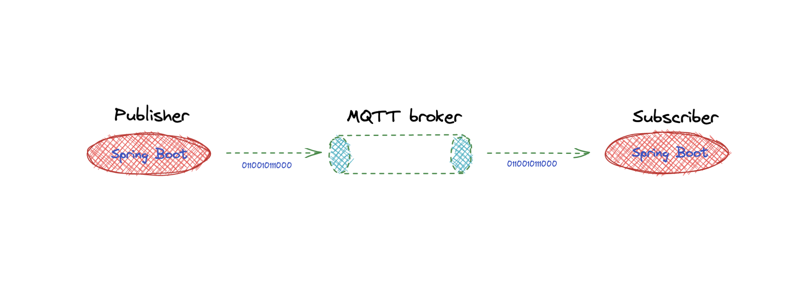
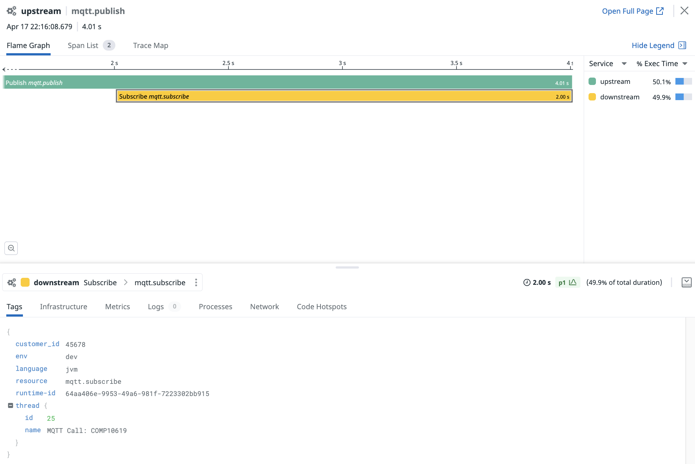

## Spring Boot and MQTT Tutorial - Custom instrumentation working example

[](https://sonarcloud.io/dashboard?id=com.codenotfound%3Aspring-kafka-hello-world)

### Introduction

The purpose of this tutorial is to show how custom instrumentation can be implemented to trace a Java application using MQTT.
The sections of this tutorial are structured as follows

* Goal
* Pre-requisites
* Clone the repository
* Directory structure of the project
* Overview of the application
* Building the application
* Building the docker images and run the application
* Testing the application
* Conclusion

In each section, we'll describe the required steps to take in order to reach the goal.


### Goal of this lab

This tutorial is meant to understand how the Datadog Java sdk (`dd-trace-ot.jar`) can be used to efficiently instrument a Java Spring Boot application that interacts with a MQTT Broker.

### Pre-requisites

+ About 30 minutes
+ JDK 1.8 or later
+ Git client
+ A Datadog account with a valid API key
+ Your favorite text editor or IDE (Ex IntelliJ)
+ Docker
+ Gradle 5+ or Maven 3.2+

### Clone the repository

<pre style="font-size: 12px">
COMP10619:~ pejman.tabassomi$ git clone https://github.com/ptabasso2/springboot-mqtt.git
</pre>

### Directory structure of the project

The example below is the structure after having built the app.

```shell
COMP10619:springboot-mqtt pejman.tabassomi$ tree
.
├── Dockerfile.mqtt
├── Dockerfile.spring
├── README.md
├── apikey.env
├── docker-compose.yml
├── docker-entrypoint.sh
├── img
├── mosquitto-no-auth.conf
├── mosquitto.conf
└── springbootmqtt
    ├── README.md
    ├── build
    │   ├── libs
    │   │   └── springboot-mqtt-1.0.jar
    │   ├── resources
    │   │   └── main
    │   │       └── application.properties
    │   └── tmp
    │       ├── bootJar
    │       │   └── MANIFEST.MF
    │       └── compileJava
    │           └── source-classes-mapping.txt
    ├── build.gradle
    ├── commands
    ├── gradle
    │   └── wrapper
    │       ├── gradle-wrapper.jar
    │       └── gradle-wrapper.properties
    ├── gradlew
    └── src
        └── main
            ├── java
            │   └── com
            │       └── datadoghq
            │           └── pej
            │               ├── Application.java
            │               ├── MessagingService.java
            │               ├── MqttConfiguration.java
            │               └── MqttController.java
            └── resources
                └── application.properties

```

The main components of this project can be described as follows:
+ The `springbootmqtt` directory that contains the entire springboot project. </br>
+ The various docker files needed to build the images and the docker-compose configuration to spin up the three containers (`dd-agent`, `mosquitto broker`, `spring boot app`).
+ The `apikey.env` file that will contain the API key required to authenticate the Datadog Agent to the platform (ex `DD_API_KEY=6xxxxxxxxxxxxxxxxxxxxxxxxxx2`)


### Observations related to the application

* The application is based on four java classes.
* `MqttConfiguration` which will hold the appropriate information to connect the MQTT client to the broker
* `MessagingService` this is the main place where all the tracing primitives are added for the publish/subscribe methods.
* `MqttController` The spring boot controller that will handle the http requests that will in turn trigger the MQTT calls.
* `Application` The spring boot class that will contain spring boot's main method which is responsible for starting the application.

As MQTT is a binary protocol we won't be able to rely on http headers to propagate the tracing context as we would normally do when applications use HTTP.
In order to get around this, we will use the Datadog tracing sdk and modify the application data structures so that we can inject and pass the context in the binary stream layer instead.

The scheme is described as follows:

Inject context -> text map -> custom code that serializes text map to binary -> mqtt -> custom code that deserializes to text map -> text map -> extract.

The propagation context is built upon the following three correlation ids:

* `x-datadog-trace-id`
* `x-datadog-parent-id`
* `x-datadog-sampling-priority`

We will rely on `tracer.inject()/extract()` method invocations to show how context propagation occurs on both sides

The implementation logic is as follows:
* A map structure `mapinject` (`HashMap` type) that will hold the above ids is declared and initialized through the `tracer.inject()` call
* When invoking the `tracer.inject()` method, the map will get filled with those ids in the form of key/value pairs.
* We will then need to serialize this data structure to obtain a byte array. This array will be merged with another one that contains the application message that is being sent to the subscribing MQTT client (`mqttClient.subsribe()`)
* The resulting byte array will then be used by the publishing Mqtt client (through the `mqttClient.publish()` method) to send the message to the MQTT broker
* On the other side of the broker (Downstream => consumer), the corresponding Mqtt client will invoke the `mqttClient.subscribe()` method to consume the message and process it.


### Publisher

**Injecting the propagation context**

```java

/* Filling mapinject with header values */
Map<String,String> mapinject =new HashMap<>();
Span span = tracer.buildSpan("Publish").start();
tracer.inject(span.context(), Format.Builtin.TEXT_MAP, new TextMapAdapter(mapinject));

```

**Serialization**

```java

/* Serializing mapinject and converting the HashMap to a byte array */
ByteArrayOutputStream byteOut = new ByteArrayOutputStream();
ObjectOutputStream out = new ObjectOutputStream(byteOut);
out.writeObject(mapinject);
byte[] map = byteOut.toByteArray();

/* Serializing string message to a byte array */
byte[] message = data.getBytes();

/* JOin both byte arrays (map and message) to form a payload byte array */
ByteArrayOutputStream outInternal = new ByteArrayOutputStream();
outInternal.write(map);
outInternal.write(message);
byte[] payload = outInternal.toByteArray();

```


**Building the message object and publishing to the broker**

```java
/* Wrapping the payload in the MqttMessage object */
MqttMessage mqttMessage = new MqttMessage();
mqttMessage.setPayload(payload);
mqttMessage.setQos(qos);
mqttMessage.setRetained(retained);

/* Building the parent span for the publish operation */
try (Scope scope = tracer.activateSpan(span)) {
   span.setTag("service.name", "Upstream");
   span.setTag("span.type", "custom");
   span.setTag("resource.name", "mqtt.publish");
   span.setTag("resource", "mqtt.publish");
   span.setTag("customer_id", "45678");

   mqttClient.publish(topic, mqttMessage);

   Thread.sleep(2000L);
  } finally {
    span.finish();
  }

```

**Notes**

* We use a span builder and start the span at the same time.
* In order to maintain the trace context over the process boundaries and remote calls,
  we need a way to propagate the span context over the wire.
  The OpenTracing API provides two functions in the Tracer interface to do that, `inject(spanContext, format, carrier)` and `extract(format, carrier)`.
* A Carrier is an interface or data structure that’s useful for inter-process communication (IPC). It “carries” the tracing state from one process to another.
  It allows the tracer to write key-value pairs via `put(key, value)` method for a given format.
* The `format` parameter refers to one of the three standard encodings (`TEXT_MAP`, `HTTP_HEADERS`, `BINARY`) that define how the span context gets encoded. In our case this will be the `TEXT_MAP` format.
* The `try-with-resources` block is used to activate the span and wrap the previous instructions.
* The Mqtt call remains the same, the only difference is that after the`inject()` call, the map now will contain the three additional headers.


### Subscriber

**Extracting and splitting the payload**

```java
/* Splitting the payload and extracting the first 203 bytes (fixed length) representing the serialized map */
byte[] serializedmap = Arrays.copyOfRange(msg.getPayload(), 0, MAPSIZE);

/* Extracting the next 4 bytes (variable length) which are representing the string message */
byte[] stringmessage = Arrays.copyOfRange(msg.getPayload(), MAPSIZE, msg.getPayload().length);
```


**Deserializing the map and retrieving the message**

```java
/* Deserializing the map */
ByteArrayInputStream bIn = new ByteArrayInputStream(serializedmap);
ObjectInputStream in = new ObjectInputStream(bIn);
Map<String, String> mapextract = (Map<String, String>) in.readObject();

/* Deserializing the string */
String messageReceived = new String(stringmessage);

```


**Retrieving the parent span context and creating a child span**

````java
/* Retrieving the context of the parent span after */
SpanContext parentSpan = tracer.extract(Format.Builtin.TEXT_MAP, new TextMapAdapter(mapextract));

/* Building the child span and nesting it under the parentspan */
Span childspan = tracer.buildSpan("Subscribe").asChildOf(parentSpan).start();
try (Scope scope = tracer.activateSpan(childspan)) {
     childspan.setTag("service.name", "Downstream");
     childspan.setTag("span.type", "custom");
     childspan.setTag("resource.name", "mqtt.subscribe");
     childspan.setTag("resource", "mqtt.subscribe");
     childspan.setTag("customer_id", "45678");
     Thread.sleep(2000L);
     logger.info("Message received: " + messageReceived);

} finally {
     childspan.finish();
}
````

### Build the application

````shell
COMP10619:springboot-mqtt pejman.tabassomi$ gradle -b springbootmqtt/build.gradle build

> Task :compileJava
Note: /Users/pejman.tabassomi/mqtt/springboot-mqtt/springbootmqtt/src/main/java/com/datadoghq/pej/MessagingService.java uses unchecked or unsafe operations.
Note: Recompile with -Xlint:unchecked for details.

Deprecated Gradle features were used in this build, making it incompatible with Gradle 7.0.
Use '--warning-mode all' to show the individual deprecation warnings.
See https://docs.gradle.org/6.9.1/userguide/command_line_interface.html#sec:command_line_warnings

BUILD SUCCESSFUL in 2s
3 actionable tasks: 3 executed
````

At this stage, the artifact that will be produced (`springboot-mqtt-1.0.jar`) will be placed under the `springbootmqtt/build/libs` directory that gets created during the build process.

### Build the docker images and run the application

````shell
COMP10619:springboot-mqtt pejman.tabassomi$ docker-compose up -d
Creating network "mqtt-app" with driver "bridge"
Building mqtt-broker
[+] Building 1.8s (9/9) FINISHED                                                                                                                                                                 
 => [internal] load build definition from Dockerfile.mqtt                                                                                                                                   0.0s
 => => transferring dockerfile: 4.67kB                                                                                                                                                      0.0s
 => [internal] load .dockerignore                                                                                                                                                           0.0s
 => => transferring context: 2B                                                                                                                                                             0.0s
 => [internal] load metadata for docker.io/library/alpine:3.14                                                                                                                              1.6s
 => [1/4] FROM docker.io/library/alpine:3.14@sha256:06b5d462c92fc39303e6363c65e074559f8d6b1363250027ed5053557e3398c5                                                                        0.0s
 => [internal] load build context                                                                                                                                                           0.1s
 => => transferring context: 40.68kB                                                                                                                                                        0.1s
 => CACHED [2/4] RUN set -x &&     apk --no-cache add --virtual build-deps         build-base         cmake         cjson-dev         gnupg         libressl-dev         linux-headers      0.0s
 => CACHED [3/4] COPY mosquitto.conf /mosquitto/config/mosquitto.conf                                                                                                                       0.0s
 => CACHED [4/4] COPY docker-entrypoint.sh mosquitto-no-auth.conf /                                                                                                                         0.0s
 => exporting to image                                                                                                                                                                      0.0s
 => => exporting layers                                                                                                                                                                     0.0s
 => => writing image sha256:257b4a42658d9ed50696e31ff486381fd67339d87a93c2518d22bd4035112f82                                                                                                0.0s
 => => naming to docker.io/mqtt/mosquitto:v0                                                                                                                                                0.0s

Use 'docker scan' to run Snyk tests against images to find vulnerabilities and learn how to fix them
WARNING: Image for service mqtt-broker was built because it did not already exist. To rebuild this image you must use `docker-compose build` or `docker-compose up --build`.
Building springbootmqtt
[+] Building 2.2s (7/7) FINISHED                                                                                                                                                                 
 => [internal] load build definition from Dockerfile.spring                                                                                                                                 0.0s
 => => transferring dockerfile: 227B                                                                                                                                                        0.0s
 => [internal] load .dockerignore                                                                                                                                                           0.0s
 => => transferring context: 2B                                                                                                                                                             0.0s
 => [internal] load metadata for docker.io/adoptopenjdk/openjdk11:jdk-11.0.11_9-debian                                                                                                      1.1s
 => CACHED [1/2] FROM docker.io/adoptopenjdk/openjdk11:jdk-11.0.11_9-debian@sha256:0140ebc813510bd628653d517ebf8ce23e80b6c7d7c899813584688940b56661                                         0.0s
 => [internal] load build context                                                                                                                                                           0.6s
 => => transferring context: 27.27MB                                                                                                                                                        0.6s
 => [2/2] COPY springbootmqtt/build/libs/springboot-mqtt-1.0.jar springboot-mqtt-1.0.jar                                                                                                    0.1s
 => exporting to image                                                                                                                                                                      0.2s
 => => exporting layers                                                                                                                                                                     0.2s
 => => writing image sha256:01073df8448cdb1093f377e005e7f854ca8d0db31453de67a30014e4b2b5ec05                                                                                                0.0s
 => => naming to docker.io/mqtt/springmqtt:v0                                                                                                                                               0.0s

Use 'docker scan' to run Snyk tests against images to find vulnerabilities and learn how to fix them
WARNING: Image for service springbootmqtt was built because it did not already exist. To rebuild this image you must use `docker-compose build` or `docker-compose up --build`.
Creating dd-agent-0     ... done
Creating mosquitto  ... done
Creating springbootmqtt ... done
````

At this stage our application is up and running and based on these three distinct services
* MQTT Broker
* Datadog Agent
* Spring Boot service


<p align="left">
  
</p>


### Test the application

1. In another terminal window run the following command, you should receive the answer `Ok`

<pre style="font-size: 12px">
COMP10619:springboot-mqtt pejman.tabassomi$ curl localhost:8080/Mqtt
OK
</pre>

2. Then by simply checking the log output, we can verify that the message processing works well.

````shell
COMP10619:springboot-mqtt pejman.tabassomi$ docker logs springbootmqtt
Picked up JAVA_TOOL_OPTIONS: -Ddd.env=dev -Ddd.tags=env:dev
LOGBACK: No context given for c.q.l.core.rolling.SizeAndTimeBasedRollingPolicy@2128029086

  .   ____          _            __ _ _
 /\\ / ___'_ __ _ _(_)_ __  __ _ \ \ \ \
( ( )\___ | '_ | '_| | '_ \/ _` | \ \ \ \
 \\/  ___)| |_)| | | | | || (_| |  ) ) ) )
  '  |____| .__|_| |_|_| |_\__, | / / / /
 =========|_|==============|___/=/_/_/_/
 :: Spring Boot ::        (v2.2.2.RELEASE)

2022-04-17 19:12:02 [main] INFO  com.datadoghq.pej.Application - Starting Application on 4fc02e5563fe with PID 1 (/springboot-mqtt-1.0.jar started by root in /)
2022-04-17 19:12:02 [main] INFO  com.datadoghq.pej.Application - No active profile set, falling back to default profiles: default
2022-04-17 19:12:03 [main] INFO  o.s.i.c.DefaultConfiguringBeanFactoryPostProcessor - No bean named 'errorChannel' has been explicitly defined. Therefore, a default PublishSubscribeChannel will be created.
...
2022-04-17 19:12:05 [dd-task-scheduler] INFO  datadog.trace.core.StatusLogger - DATADOG TRACER CONFIGURATION {"version":"0.90.0~32708e53ec","os_name":"Linux","os_version":"5.10.76-linuxkit","architecture":"amd64","lang":"jvm","lang_version":"11.0.11","jvm_vendor":"AdoptOpenJDK","jvm_version":"11.0.11+9","java_class_version":"55.0","http_nonProxyHosts":"null","http_proxyHost":"null","enabled":true,"service":"springboot-mqtt-1.0","agent_url":"http://dd-agent-0:8126","agent_error":false,"debug":false,"analytics_enabled":false,"sampling_rules":[{},{}],"priority_sampling_enabled":true,"logs_correlation_enabled":true,"profiling_enabled":false,"appsec_enabled":false,"dd_version":"0.90.0~32708e53ec","health_checks_enabled":true,"configuration_file":"no config file present","runtime_id":"64aa406e-9953-49a6-981f-7223302bb915","logging_settings":{},"cws_enabled":false,"cws_tls_refresh":5000}
2022-04-17 19:12:05 [main] INFO  o.s.s.c.ThreadPoolTaskExecutor - Initializing ExecutorService 'applicationTaskExecutor'
2022-04-17 19:12:05 [main] INFO  o.s.s.c.ThreadPoolTaskScheduler - Initializing ExecutorService 'taskScheduler'
2022-04-17 19:12:05 [main] INFO  o.s.i.endpoint.EventDrivenConsumer - Adding {logging-channel-adapter:_org.springframework.integration.errorLogger} as a subscriber to the 'errorChannel' channel
2022-04-17 19:12:05 [main] INFO  o.s.i.c.PublishSubscribeChannel - Channel 'application.errorChannel' has 1 subscriber(s).
2022-04-17 19:12:05 [main] INFO  o.s.i.endpoint.EventDrivenConsumer - started bean '_org.springframework.integration.errorLogger'
2022-04-17 19:12:05 [main] INFO  o.s.b.w.e.tomcat.TomcatWebServer - Tomcat started on port(s): 8080 (http) with context path ''
2022-04-17 19:12:05 [main] INFO  com.datadoghq.pej.Application - Started Application in 4.079 seconds (JVM running for 4.918)
2022-04-17 19:17:51 [http-nio-8080-exec-1] INFO  o.a.c.c.C.[Tomcat].[localhost].[/] - Initializing Spring DispatcherServlet 'dispatcherServlet'
2022-04-17 19:17:51 [http-nio-8080-exec-1] INFO  o.s.web.servlet.DispatcherServlet - Initializing Servlet 'dispatcherServlet'
2022-04-17 19:17:51 [http-nio-8080-exec-1] INFO  o.s.web.servlet.DispatcherServlet - Completed initialization in 16 ms
2022-04-17 19:17:53 [http-nio-8080-exec-1] INFO  com.datadoghq.pej.MqttController - Publish/subscribe steps in Controller
2022-04-17 19:17:53 [MQTT Call: COMP10619] INFO  com.datadoghq.pej.MessagingService - Message received: This is a sample message published to topic pejman/topic/event
````

In particular, the last line of these log events displays the message received.

3. Checking the related APM trace in the Datadog UI

<p align="left">
  
</p>

